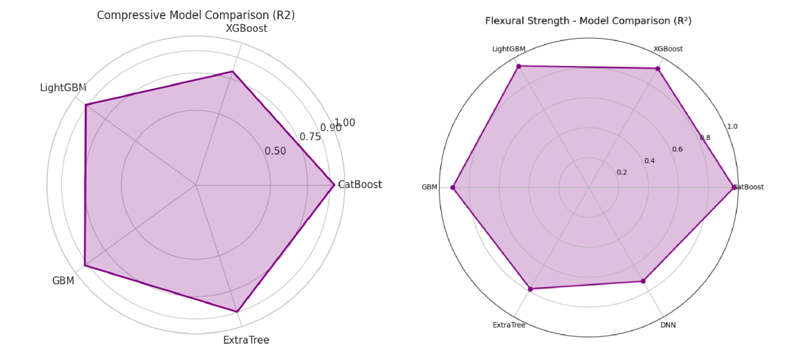
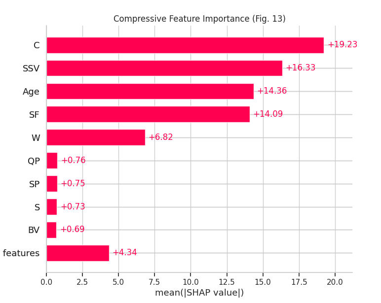
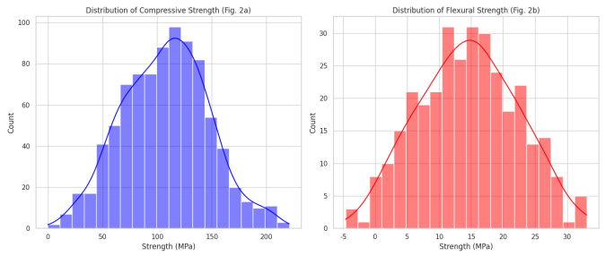
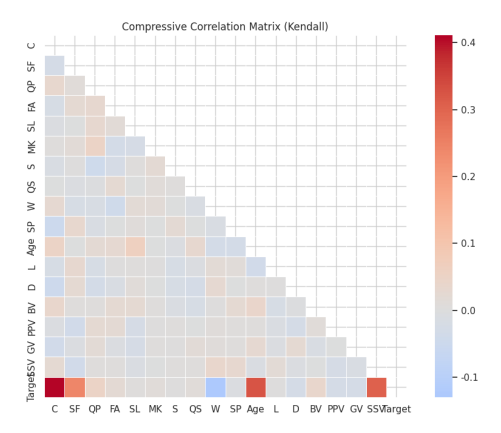
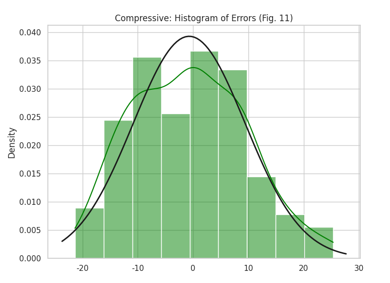

# UHPC-replication
Six ML algorithms were used to predict the mechanical properties of fiber-type UHPC . Reproduced core conclusions matched the original paper: CatBoost performed best, DNN the poorest. Yet, data-related issues caused acceptable discrepancies in SHAP feature importance ranking and GUI predicted values.


# 混凝土强度预测系统

基于机器学习的混凝土抗压/抗折强度预测工具，集成 CatBoost、XGBoost、LightGBM 等多种算法，提供 SHAP 可解释性分析和 PyQt5 交互界面。

# 📋 Contents

- [Environment Setup](#environment-setup)
- [Dependencies Installation](#dependencies-installation)
- [How to Run](#how-to-run)
- [Functionality Description](#functionality-description)
- [Simulation Results](#simulation-results)
- [Citation](#citation)

##  Environment Setup

### 1. VM Configuration
- Download and Configure VMware Virtual Environment.

### 2. Python Environment
- Python **3.10.12** Installation
- Recommend Creating a Virtual Environment：
  ```
  python3.10 -m venv venv
  source venv/bin/activate  # Linux/Mac
  # or venv\Scripts\activate  # Windows
  ```
  
##  Dependencies Installation
```bash
git clone https://github.com/Yves1415/UHPC-replication.git
cd UHPC-replication
pip3 install -r requirements.txt
# pip install numpy pandas matplotlib seaborn shap xgboost lightgbm catboost scikit-learn tensorflow pyqt5
```

 ### Install Verification
```
python -c "import shap; import catboost; import PyQt5; print('All Dependencies Installed Successfully')"
```

 ## How to Run
```
python main2.py
```

 ## Functionality Description
| Module| Function Description |
|:---------:|:---------:|
|Data Generation	| Simulate 863 sets of compressive strength and 321 sets of flexural strength data|
|Model Training	| Support CatBoost, XGBoost, LightGBM, GBM, ExtraTree and DNN |
|Scientific Plotting	| SHAP analysis, radar chart, heat map and error analysis|
|GUI Interface| Interactive strength prediction software based on PyQt5 |


# Simulation Results

> The simulated dataset was generated using the Monte Carlo simulation method based on the statistical distribution characteristics of the original data for model training.Based on the mean, standard deviation, and extreme values reported in Tables 1 and 2 of the original paper, a truncated normal distribution was employed to generate 863 samples for compressive strength and 321 samples for flexural strength.The input feature space comprises 17 mixture proportion parameters. The target variables—compressive strength and flexural strength—were generated using a semi‑empirical model that incorporates key influencing factors such as age and fiber volume fraction. Gaussian noise was added to simulate experimental measurement errors.The dataset was randomly divided into a training set (80%) and a test set (20%), with a random seed of 42 to ensure reproducibility. Additionally, Z‑score normalization was applied to all continuous features.

>The simulation results are explained below based on the figures.
Figure 1: Demonstrates the performance of different models in predicting UHPC. Based on the R-square  values or directly from the figure, CatBoost achieves the optimal performance, while DNN performs the worst.
Figure 2: SHAP feature importance ranking. Factors such as Age, SSV and SF are key positive influencing factors, whereas W is a key negative influencing factor.
Figure 3: SSV shows the most significant performance in both analyses, which is consistent with the basic mechanical principles of UHPC materials.
Figure 4: Demonstrates the distribution of compressive strength and flexural strength of UHPC, which is actually used to display the strength distribution in the dataset.
Figure 5: Feature Correlation Heatmap: SF, Age and SSV are key positive influencing factors.
Figure 6: Displays the error distribution of the CatBoost model in predicting compressive strength. Most errors are concentrated between -10 MPa and +10 MPa, indicating that our model has relatively high prediction accuracy.












> Model Performance on the Dataset.
Taking Compressive Strength as an Example:

|Model        |R-Square           |RMSE   |
|-------------|-------------------|-------|
|XGBoost      |0.803              |0.102  |
|CatBoost     |   0.943           |  2.25 | 
|LightGBM     |    0.921          |  3.85 |  
|GBM          |   0.933           |  3.87 |    
|ExtraTree    |    0.908          |  8.39 |     
|DNN          |   0.739           |  5.88 |    

# Citation

If this code is helpful for you, Please cite this publications:

```bibtex
@article{bolbolvand2025prediction,
  title={Prediction of compressive and flexural strengths of ultra-high-performance concrete (UHPC) using machine learning for various fiber types},
  author={Bolbolvand, Milad and Tavakkoli, Seyed Mehdi and Alaee, Farshid Jandaghi},
  journal={Construction and Building Materials},
  volume={493},
  pages={143135},
  year={2025},
  publisher={Elsevier}
}
```

<div align="right">
    <b><a href="#目录">↥ back to top</a></b>
</div>
